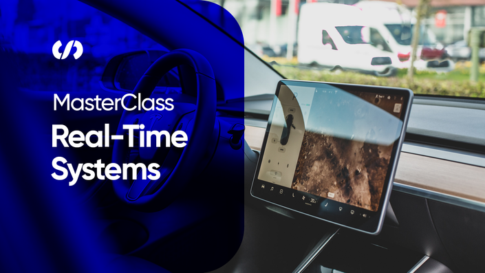

# Real-time Systems MasterClass

## Assignments Progress

- [x] Assignment_01: [Introduction to FreeRTOS](https://youtu.be/YWIPaMj4Bj4)

- [x] Assignment_02: Inter-Process communication ([Part 1](https://youtu.be/j1pzSMiusb0) - [Part 2](https://youtu.be/KNfUjNxfFfs))

- [x] Assignment_03: [Designing a real-time system](https://youtu.be/yhMOwm8J5zk)

- [x] Assignment_04: [Scheduling and Types of schedulers](https://youtu.be/wV9ZsEIN9As)

- [x] Assignment_05: [Graduation Project](https://youtu.be/GxDrmm0VH2M)
